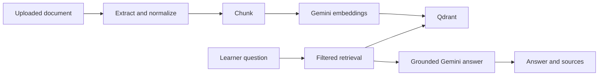

# LearnOS RAG

Retrieval-Augmented Generation (RAG) lets the LearnOS tutor answer from a learner's uploaded material instead of treating an LLM as the source of truth. Phase 1 supports PDF, DOCX, TXT, and Markdown resources.



The application remains a Next.js/MongoDB application. MongoDB owns resource metadata and authorization; Qdrant stores searchable chunk vectors. Every Qdrant query includes the authenticated Clerk `userId` filter.

The lesson tutor remains useful before a learner uploads material: it uses a compact reference extracted from the generated lesson content when no relevant document chunks are available. Document-backed replies additionally show their sources.

## Local setup

Start a local vector database:

```powershell
docker run --rm -p 6333:6333 qdrant/qdrant
```

Copy the RAG settings in `.env.example` to `.env`, set `GEMINI_API_KEY`, and run the application. Add a supported file in **My Resources**, then choose **Process for AI**. Ask the lesson tutor a question to see retrieved sources.

See [configuration.md](configuration.md), [ingestion.md](ingestion.md), and [retrieval.md](retrieval.md) for the complete flow.
