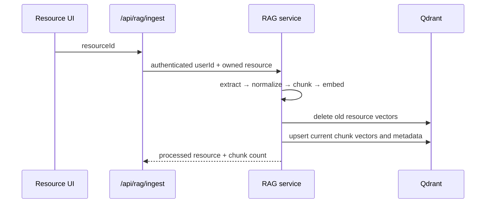

# RAG Architecture

## Responsibilities

| Layer        | Responsibility                                                                         |
| ------------ | -------------------------------------------------------------------------------------- |
| Ingestion    | Extract, normalize, and chunk a local uploaded file.                                   |
| Embeddings   | Convert document chunks and questions into Gemini vectors.                             |
| Vector store | Create the Qdrant collection, upsert, search, and delete vectors.                      |
| Retrieval    | Apply mandatory user and optional resource/lesson filters, then retrieve Top-K chunks. |
| Generation   | Build compact source-labelled context and request a grounded Gemini response.          |

The RAG modules do not make database authorization decisions from client input. `rag-service.js` validates the MongoDB resource/lesson ownership before retrieval or ingestion.
