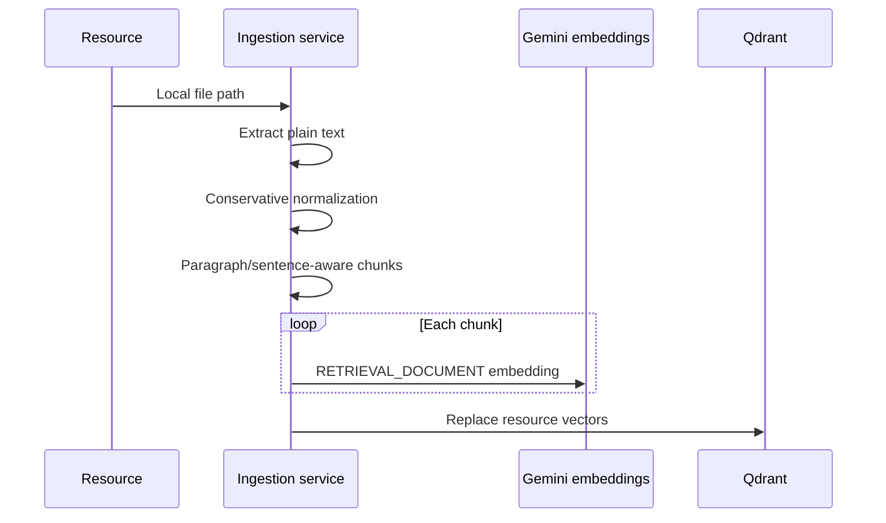

# Document Ingestion

`POST /api/rag/ingest` accepts an owned `resourceId`. It is synchronous in Phase 1 because LearnOS has no existing job infrastructure.

Supported formats are PDF (`pdf-parse`), DOCX (`mammoth`), TXT, and Markdown. PPT/PPTX, images, links, OCR, and web ingestion are intentionally outside Phase 1.

`processedStatus` preserves the existing resource state model and adds `processing`:

- `pending`: saved but not indexed.
- `processing`: synchronous extraction/indexing is underway.
- `processed`: all current chunks were written to Qdrant.
- `failed`: a safe error is stored in `processingError`.

Chunks default to 1,200 characters with 200-character overlap. Paragraphs and sentence boundaries are preferred; overlap reduces the chance that related meaning is split across adjacent chunks. Both values are environment configuration, not hardcoded contract values.
