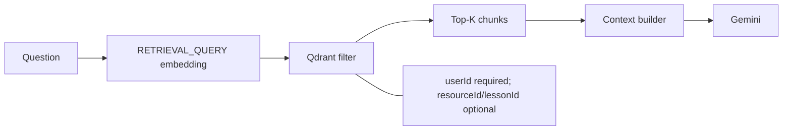

# Retrieval and Grounded Answers

`POST /api/rag/query` accepts a `question` and optional `resourceId`/`lessonId`. Clerk provides the mandatory user identity.

```json
{
  "question": "Why is metadata filtering important?",
  "lessonId": "optional-lesson-id"
}
```



The server confirms that optional resource and lesson IDs belong to the authenticated user before querying. Qdrant then receives a mandatory `userId` filter, which prevents cross-user document retrieval even if a client submits another user's ID.

Example response:

```json
{
  "answer": "Metadata filters scope retrieval to the learner's own resources.",
  "sources": [{ "resourceId": "…", "lessonId": "…", "chunkIndex": 0, "title": "Security notes", "sourceType": "pdf" }]
}
```

When no chunks match, LearnOS returns a clear no-evidence response rather than fabricating a source-based answer.

Lesson chat has one deliberate usability fallback: if a learner has no matching processed document, it sends a bounded projection of the already-generated lesson content to Gemini. This keeps normal actions such as **Summarize Lesson** usable without pretending they came from an uploaded resource; the response has an empty `sources` array. The standalone RAG query endpoint remains retrieval-only.
